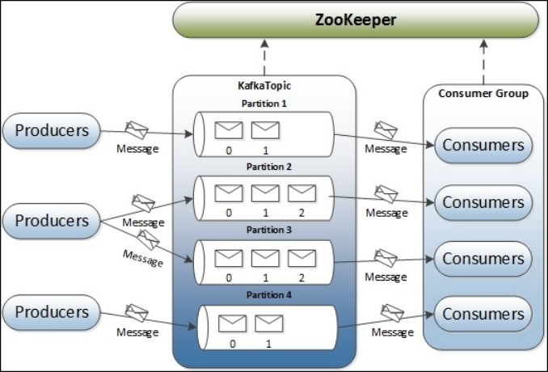
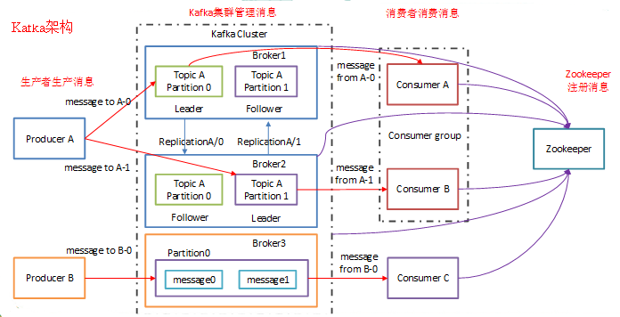
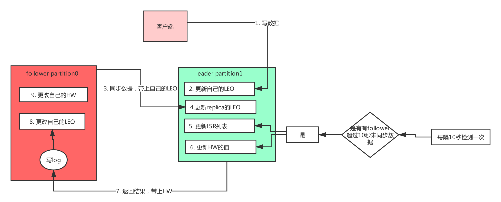
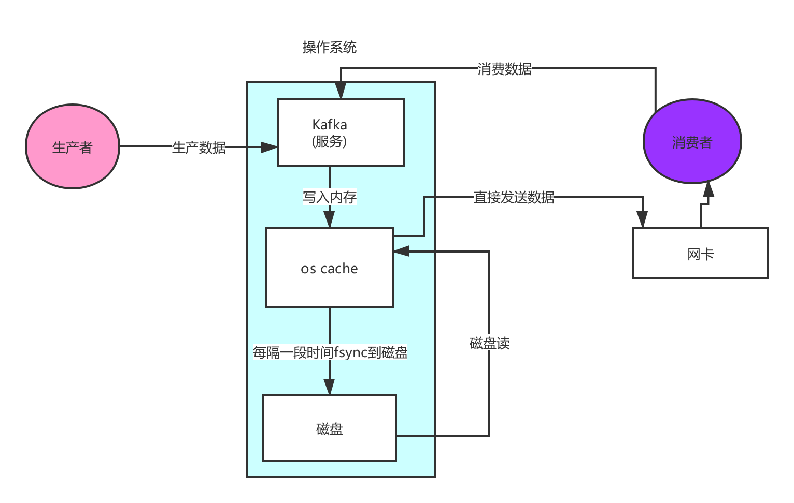
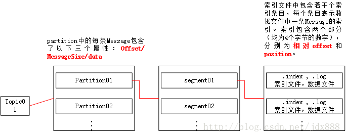
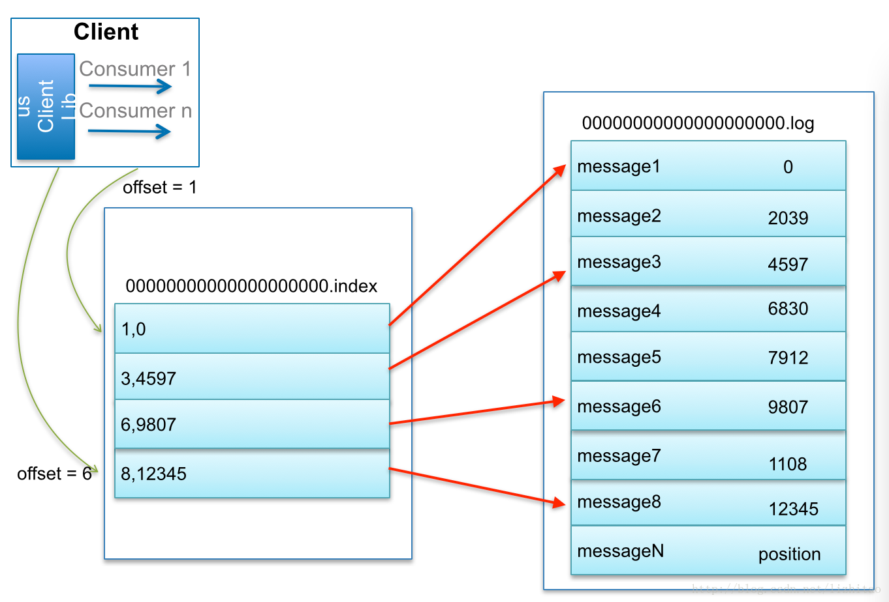
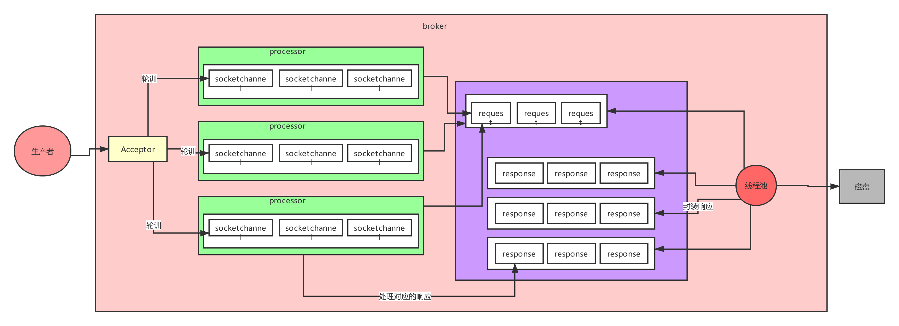

# 深入浅出Kafka-第一天

## 一 、课前准备

掌握NIO基础知识

## 二 、课堂主题

本课程主要讲解Kafka的基础知识和内核原理

## 三 、课程目标

1. 了解为什么有消息系统
2. 掌握Kafka的架构原理
3. 掌握Kafka的内核原理

## 四 、知识要点

#### 4.1 Kafka基础知识

##### 4.1.1 为什么有消息系统

**解耦**
允许你独立的扩展或修改两边的处理过程，只要确保它们遵守同样的接口约束。

**冗余**
消息队列把数据进行持久化直到它们已经被完全处理，通过这一方式规避了数据丢失风险。许多消息队列所采用的"插入-获取-删除"范式中，在把一个消息从队列中删除之前，需要你的处理系统明确的指出该消息已经被处理完毕，从而确保你的数据被安全的保存直到你使用完毕。

**扩展性**
因为消息队列解耦了你的处理过程，所以增大消息入队和处理的频率是很容易的，只要另外增加处理过程即可。

**灵活性 & 峰值处理能力**
在访问量剧增的情况下，应用仍然需要继续发挥作用，但是这样的突发流量并不常见。如果为以能处理这类峰值访问为标准来投入资源随时待命无疑是巨大的浪费。使用消息队列能够使关键组件顶住突发的访问压力，而不会因为突发的超负荷的请求而完全崩溃。

**可恢复性**
系统的一部分组件失效时，不会影响到整个系统。消息队列降低了进程间的耦合度，所以即使一个处理消息的进程挂掉，加入队列中的消息仍然可以在系统恢复后被处理。

**顺序保证**
在大多使用场景下，数据处理的顺序都很重要。大部分消息队列本来就是排序的，并且能保证数据会按照特定的顺序来处理。（Kafka 保证一个 Partition 内的消息的有序性）

**缓冲**
有助于控制和优化数据流经过系统的速度，解决生产消息和消费消息的处理速度不一致的情况。

**异步通信**
很多时候，用户不想也不需要立即处理消息。消息队列提供了异步处理机制，允许用户把一个消息放入队列，但并不立即处理它。想向队列中放入多少消息就放多少，然后在需要的时候再去处理它们。

##### 4.1.2 Kafka核心概念

**producer**
 消息生产者，发布消息到 Kafka集群的终端或服务。
**broker**
Kafka集群中包含的服务器。
 **topic**
 每条发布到 Kafka集群的消息属于的类别，即 Kafka是面向 topic 的。
 **partition**
 partition 是物理上的概念，每个 topic 包含一个或多个 partition。Kafka分配的单位是 partition。
 **consumer**
 从 Kafka集群中消费消息的终端或服务。
 **Consumer group**
 high-level consumer API 中，每个 consumer 都属于一个 consumer group，每条消息只能被 consumer group 中的一个 Consumer 消费，但可以被多个 consumer group 消费。
 **replica**
 partition 的副本，保障 partition 的高可用。
 **leader**
 replica 中的一个角色， producer 和 consumer 只跟 leader 交互。
 **follower**
 replica 中的一个角色，从 leader 中复制数据。
 **controller**
 知道大家有没有思考过一个问题，就是Kafka集群中某个broker宕机之后，是谁负责感知到他的宕机，以及负责进行Leader Partition的选举？如果你在Kafka集群里新加入了一些机器，此时谁来负责把集群里的数据进行负载均衡的迁移？包括你的Kafka集群的各种元数据，比如说每台机器上有哪些partition，谁是leader，谁是follower，是谁来管理的？如果你要删除一个topic，那么背后的各种partition如何删除，是谁来控制？还有就是比如Kafka集群扩容加入一个新的broker，是谁负责监听这个broker的加入？如果某个broker崩溃了，是谁负责监听这个broker崩溃？这里就需要一个Kafka集群的总控组件，Controller。他负责管理整个Kafka集群范围内的各种东西。

**Zookeeper**

(1)	Kafka 通过 zookeeper 来存储集群的 meta 信息。
(2)	一旦controller所在broker宕机了，此时临时节点消失，集群里其他broker会一直监听这个临时节点，发现临时节点消失了，就争抢再次创建临时节点，保证有一台新的broker会成为controller角色。

#### 4.2 Kafka内核原理

##### 4.2.1 HW&LEO原理

**LEO**
last end offset，日志末端偏移量，记录了该副本对象底层日志文件中下一条消息的位移值。举一个例子，若LEO=10，那么表示在该副本日志上已经保存了10条消息，位移范围是[0，9]。
**HW**
Highwatermark，高水印值，任何一个副本对象的HW值一定不大于其LEO值，而小于或等于HW值的所有消息被认为是“已提交的”或“已备份的”。
HW指向的是实实在在的消息，而LEO总是指向下一条待写入消息，也就是说LEO指向的位置上是没有消息的，例如HW值是7，这表示前8条消息（位移从0计数）都已经处于“已备份状态”；而LEO值是12，则表示当前日志中写入了11条消息，而消息8、9、10、11尚未完全备份，即它们属于未提交消息。
**follower更新LEO的机制**
follower副本的LEO保存在2个地方：
（1）follower副本所在的broker缓存里。
（2）leader所在broker的缓存里，也就是leader所在broker的缓存上保存了该分区所有副本的LEO。
 follower的LEO何时更新呢？在follower发送FETCH请求后，leader将数据返回给follower，此时follower开始向底层log写数据，从而自动更新其LEO值，每当新写入一条消息，其LEO值就会加1。
 leader的LEO何时更新呢？发生在leader处理follower FETCH请求时。一旦leader接收到follower发送的FETCH请求，它首先会从自己的log中读取相应的数据，但是在给follower返回数据之前它先去更新follower的LEO。
**leader更新LEO机制**
leader的LEO就保存在其所在broker的缓存里，leader写log时就自动更新其LEO值。
**follower更新HW的机制**
follower更新HW发生在其更新LEO之后，一旦follower向log写完数据，它就会尝试更新HW值。具体算法就是比较当前LEO值与FETCH响应中leader的HW值，取两者的小者作为新的HW值。这告诉我们一个事实：如果follower的LEO值超过了leader的HW值，那么follower HW值是不会越过leader HW值的。
**leader更新HW的机制**
leader更新HW的时机：
（1）producer 向 leader 写消息时
（2）leader 处理 follower 的 fetch 请求时
（3）某副本成为leader时
（4）broker 崩溃导致副本被踢出ISR时
leader更新HW的方式：
当尝试确定分区HW时，它会选出所有满足条件的副本，比较它们的LEO（当然也包括leader自己的LEO），并选择最小的LEO值作为HW值。
这里的满足条件主要是指副本要满足以下两个条件之一：
（1）处于ISR中
（2）副本LEO落后于leader LEO的时长不大于replica.lag.time.max.ms参数值（默认值是10秒）

##### 4.2.2 ISR机制

光是依靠多副本机制能保证Kafka的高可用性，但是能保证数据不丢失吗？不行，因为如果leader宕机，但是leader的数据还没同步到follower上去，此时即使选举了follower作为新的leader，当时刚才的数据已经丢失了。
ISR是：in-sync replica，就是跟leader partition保持同步的follower partition的数量，只有处于ISR列表中的follower才可以在leader宕机之后被选举为新的leader，因为在这个ISR列表里代表他的数据跟leader是同步的。
如果要保证写入kafka的数据不丢失，首先需要保证ISR中至少有一个follower，其次就是在一条数据写入了leader partition之后，要求必须复制给ISR中所有的follower partition，才能说代表这条数据已提交，绝对不会丢失，这是Kafka给出的承诺

##### 4.2.3 顺序写

**顺序写**

Kafka仅仅是追加数据到文件末尾，磁盘顺序写，性能极高，几乎跟写内存速度是一样高的

**随机写**

在随机在文件的某个位置修改数据，这个叫做磁盘随机写，性能是很低的，磁盘顺序写，仅仅追加数据到文件末尾

##### 4.2.4 零拷贝

非零拷贝

.png)

零拷贝

##### 4.2.5 日志分段存储

每个分区对应的目录，就是“topic-分区号”的格式，比如说有个topic叫做“order-topic”，那么假设他有3个分区，每个分区在一台机器上，那么3台机器上分别会有3个目录，“order-topic-0”，“order-topic-1”，“order-topic-2”。每个分区里面就是很多的log segment file，也就是日志段文件，每个分区的数据会被拆分为多个段，放在多个文件里，每个文件还有自己的索引文件，大概格式可能如下所示：

~~~java
00000000000000000000.index
00000000000000000000.log
00000000000000000000.timeindex

00000000000005367851.index
00000000000005367851.log
00000000000005367851.timeindex

00000000000009936472.index
00000000000009936472.log
00000000000009936472.timeindex

~~~

这个9936472之类的数字，就是代表了这个日志段文件里包含的起始offset，也就说明这个分区里至少都写入了接近1000万条数据了。Kafka broker有一个参数，log.segment.bytes，限定了每个日志段文件的大小，最大就是1GB，一个日志段文件满了，就自动开一个新的日志段文件来写入，避免单个文件过大，影响文件的读写性能，这个过程叫做log rolling，正在被写入的那个日志段文件，叫做active log segment。

##### 4.2.6 日志二分查找

日志段文件，.log文件会对应一个.index和.timeindex两个索引文件。kafka在写入日志文件的时候，同时会写索引文件，就是.index和.timeindex，一个是位移索引，一个是时间戳索引。
默认情况下，有个参数log.index.interval.bytes限定了在日志文件写入多少数据，就要在索引文件写一条索引，默认是4KB，写4kb的数据然后在索引里写一条索引，所以索引本身是稀疏格式的索引，不是每条数据对应一条索引的。而且索引文件里的数据是按照位移和时间戳升序排序的，所以kafka在查找索引的时候，会用二分查找，时间复杂度是O(logN)，找到索引，就可以在.log文件里定位到数据了。

.timeindex是时间戳索引文件，如果要查找某段时间范围内的时间，先在这个文件里二分查找找到offset，然后再去.index里根据offset二分查找找对应的.log文件里的位置，最后就去.log文件里查找对应的数据。
索引文件映射到内存中，所以查询速度是很快的。

##### 4.2.7 Kafka网络设计

