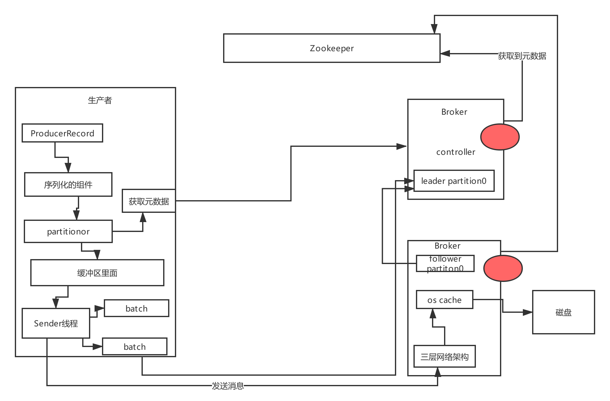

# 深入浅出Kafka-第三天

## 一 、课前准备

1. 准备好搭建好的Kafka集群

## 二 、课堂主题

本次课主要讲解Kafka Producer的原理

## 三 、课程目标

1. 掌握Kafka Producer原理
2. 掌握Kafka Producer代码开发

## 四 、知识要点

#### 4.1 Producer消息发送原理

Producer发送一条消息，首先需要选择一个topic的分区，默认是轮询来负载均衡，但是如果指定了一个分区key，那么根据这个key的hash值来分发到指定的分区，这样可以让相同的key分发到同一个分区里去，还可以自定义partitioner来实现分区策略。

~~~java
producer.send(msg); // 用类似这样的方式去发送消息，就会把消息给你均匀的分布到各个分区上去
producer.send(key, msg); // 订单id，或者是用户id，他会根据这个key的hash值去分发到某个分区上去，他可以保证相同的key会路由分发到同一个分区上去

~~~

每次发送消息都必须先把数据封装成一个ProducerRecord对象，里面包含了要发送的topic，具体在哪个分区，分区key，消息内容，timestamp时间戳，然后这个对象交给序列化器，变成自定义协议格式的数据，接着把数据交给partitioner分区器，对这个数据选择合适的分区，默认就轮询所有分区，或者根据key来hash路由到某个分区，这个topic的分区信息，都是在客户端会有缓存的，当然会提前跟broker去获取。接着这个数据会被发送到producer内部的一块缓冲区里，然后producer内部有一个Sender线程，会从缓冲区里提取消息封装成一个一个的batch，然后每个batch发送给分区的leader副本所在的broker。



#### 4.2 Producer Demo演示

~~~java
import java.util.Properties;

import org.apache.kafka.clients.producer.Callback;
import org.apache.kafka.clients.producer.KafkaProducer;
import org.apache.kafka.clients.producer.ProducerRecord;
import org.apache.kafka.clients.producer.RecordMetadata;

public class ProducerDemo {
	public static void main(String[] args) throws Exception {
		Properties props = new Properties();
		// 这里可以配置几台broker即可，他会自动从broker去拉取元数据进行缓存
		props.put("bootstrap.servers", "hadoop03:9092,hadoop04:9092,hadoop05:9092");  
		// 这个就是负责把发送的key从字符串序列化为字节数组
		props.put("key.serializer", "org.apache.kafka.common.serialization.StringSerializer");
		// 这个就是负责把你发送的实际的message从字符串序列化为字节数组
		props.put("value.serializer", "org.apache.kafka.common.serialization.StringSerializer");
		props.put("acks", "-1");
		props.put("retries", 3);
		props.put("batch.size", 323840);
		props.put("linger.ms", 10);
		props.put("buffer.memory", 33554432);
		props.put("max.block.ms", 3000);	
		// 创建一个Producer实例：线程资源，跟各个broker建立socket连接资源
		KafkaProducer<String, String> producer = new KafkaProducer<String, String>(props);
		ProducerRecord<String, String> record = new ProducerRecord<>(
				"test-topic", "test-key", "test-value");
		
		// 这是异步发送的模式
		producer.send(record, new Callback() {
			@Override
			public void onCompletion(RecordMetadata metadata, Exception exception) {
				if(exception == null) {
					// 消息发送成功
					System.out.println("消息发送成功");  
				} else {
					// 消息发送失败，需要重新发送
				}
			}

		});
		Thread.sleep(10 * 1000); 
		
		// 这是同步发送的模式
//		producer.send(record).get(); 
		// 你要一直等待人家后续一系列的步骤都做完，发送消息之后
		// 有了消息的回应返回给你，你这个方法才会退出来
		producer.close();
	}
	
}

~~~

#### 4.3 Producer核心原理剖析


#### 4.4 核心参数

**常见异常处理**

~~~java
不管是异步还是同步，都可能让你处理异常，常见的异常如下：
1）LeaderNotAvailableException：这个就是如果某台机器挂了，此时leader副本不可用，会导致你写入失败，要等待其他follower副本切换为leader副本之后，才能继续写入，此时可以重试发送即可。如果说你平时重启kafka的broker进程，肯定会导致leader切换，一定会导致你写入报错，是LeaderNotAvailableException
2）NotControllerException：这个也是同理，如果说Controller所在Broker挂了，那么此时会有问题，需要等待Controller重新选举，此时也是一样就是重试即可
3）NetworkException：网络异常，重试即可
我们之前配置了一个参数，retries，他会自动重试的，但是如果重试几次之后还是不行，就会提供Exception给我们来处理了。
参数：retries 默认值是3
参数：retry.backoff.ms  两次重试之间的时间间隔
~~~


**提升消息吞吐量**

~~~java
1）buffer.memory：设置发送消息的缓冲区，默认值是33554432，就是32MB
如果发送消息出去的速度小于写入消息进去的速度，就会导致缓冲区写满，此时生产消息就会阻塞住，所以说这里就应该多做一些压测，尽可能保证说这块缓冲区不会被写满导致生产行为被阻塞住

		  Long startTime=System.currentTime();
producer.send(record, new Callback() {

			@Override
			public void onCompletion(RecordMetadata metadata, Exception exception) {
				if(exception == null) {
					// 消息发送成功
					System.out.println("消息发送成功");  
				} else {
					// 消息发送失败，需要重新发送
				}
			}
		});
        Long endTime=System.currentTime();
        If(endTime - startTime > 100){//说明内存被压满了
         说明有问题
}

2）compression.type，默认是none，不压缩，但是也可以使用lz4压缩，效率还是不错的，压缩之后可以减小数据量，提升吞吐量，但是会加大producer端的cpu开销
3）batch.size，设置meigebatch的大小，如果batch太小，会导致频繁网络请求，吞吐量下降；如果batch太大，会导致一条消息需要等待很久才能被发送出去，而且会让内存缓冲区有很大压力，过多数据缓冲在内存里
默认值是：16384，就是16kb，也就是一个batch满了16kb就发送出去，一般在实际生产环境，这个batch的值可以增大一些来提升吞吐量，可以自己压测一下
4）linger.ms，这个值默认是0，意思就是消息必须立即被发送，但是这是不对的，一般设置一个100毫秒之类的，这样的话就是说，这个消息被发送出去后进入一个batch，如果100毫秒内，这个batch满了16kb，自然就会发送出去。但是如果100毫秒内，batch没满，那么也必须把消息发送出去了，不能让消息的发送延迟时间太长，也避免给内存造成过大的一个压力。

~~~

**请求超时**

~~~java
1）max.request.size：这个参数用来控制发送出去的消息的大小，默认是1048576字节，也就1mb，这个一般太小了，很多消息可能都会超过1mb的大小，所以需要自己优化调整，把他设置更大一些（企业一般设置成10M）
2）request.timeout.ms：这个就是说发送一个请求出去之后，他有一个超时的时间限制，默认是30秒，如果30秒都收不到响应，那么就会认为异常，会抛出一个TimeoutException来让我们进行处理
~~~


**ACK参数**

~~~java
acks参数，其实是控制发送出去的消息的持久化机制的
1）如果acks=0，那么producer根本不管写入broker的消息到底成功没有，发送一条消息出去，立马就可以发送下一条消息，这是吞吐量最高的方式，但是可能消息都丢失了，你也不知道的，但是说实话，你如果真是那种实时数据流分析的业务和场景，就是仅仅分析一些数据报表，丢几条数据影响不大的。会让你的发送吞吐量会提升很多，你发送弄一个batch出，不需要等待人家leader写成功，直接就可以发送下一个batch了，吞吐量很大的，哪怕是偶尔丢一点点数据，实时报表，折线图，饼图。

2）acks=all，或者acks=-1：这个leader写入成功以后，必须等待其他ISR中的副本都写入成功，才可以返回响应说这条消息写入成功了，此时你会收到一个回调通知


3）acks=1：只要leader写入成功，就认为消息成功了，默认给这个其实就比较合适的，还是可能会导致数据丢失的，如果刚写入leader，leader就挂了，此时数据必然丢了，其他的follower没收到数据副本，变成leader

如果要想保证数据不丢失，得如下设置：
a)min.insync.replicas = 2，ISR里必须有2个副本，一个leader和一个follower，最最起码的一个，不能只有一个leader存活，连一个follower都没有了

b)acks = -1，每次写成功一定是leader和follower都成功才可以算做成功，leader挂了，follower上是一定有这条数据，不会丢失

c) retries = Integer.MAX_VALUE，无限重试，如果上述两个条件不满足，写入一直失败，就会无限次重试，保证说数据必须成功的发送给两个副本，如果做不到，就不停的重试，除非是面向金融级的场景，面向企业大客户，或者是广告计费，跟钱的计算相关的场景下，才会通过严格配置保证数据绝对不丢失

~~~

**重试乱序**

~~~java
消息重试是可能导致消息的乱序的，因为可能排在你后面的消息都发送出去了，你现在收到回调失败了才在重试，此时消息就会乱序，所以可以使用“max.in.flight.requests.per.connection”参数设置为1，这样可以保证producer同一时间只能发送一条消息
~~~


#### 4.5 小案例演示

场景：订单系统接收到了数据以后把数据放入消息系统。然后有其他的系统消费对应数据。

~~~java
import java.util.Properties;

import org.apache.kafka.clients.producer.Callback;
import org.apache.kafka.clients.producer.KafkaProducer;
import org.apache.kafka.clients.producer.ProducerRecord;
import org.apache.kafka.clients.producer.RecordMetadata;

import com.alibaba.fastjson.JSONObject;

public class OrderProducer {
	public static KafkaProducer<String, String> createProducer() {
		 Properties props = new Properties();

			// 这里可以配置几台broker即可，他会自动从broker去拉取元数据进行缓存
			props.put("bootstrap.servers", "hadoop1:9092,hadoop2:9092,hadoop3:9092");  

			// 这个就是负责把发送的key从字符串序列化为字节数组
			props.put("key.serializer", "org.apache.kafka.common.serialization.StringSerializer");
			// 这个就是负责把你发送的实际的message从字符串序列化为字节数组
			props.put("value.serializer", "org.apache.kafka.common.serialization.StringSerializer");

			props.put("buffer.memory", 33554432);
			props.put("compression.type", "lz4");
			props.put("batch.size", 32768);
			props.put("linger.ms", 100);
			props.put("retries", 10);//5 10
			props.put("retry.backoff.ms", 300);
			props.put("request.required.acks", "1");
			
			// 创建一个Producer实例：线程资源，跟各个broker建立socket连接资源
			KafkaProducer<String, String> producer = new KafkaProducer<String, String>(props);
			return producer;
	}
	
	public static JSONObject createRecord() {
		JSONObject order=new JSONObject();
		order.put("userId", 12344);
		order.put("amount", 100.0);
		order.put("OPERATION", "pay");
		return order;
	}
  public static void main(String[] args) throws Exception {
	  
	  //步骤一：创建生产者
	  KafkaProducer<String, String> producer = createProducer();
	  //步骤二：创建小系统
	  JSONObject order=createRecord();

	 ProducerRecord<String, String> record = new ProducerRecord<>(
				"test8",order.getString("userId") ,order.toString());
		/**
		 * 
		 * 如果发送消息，消息不指定key，那么我们发送的这些消息，会被轮训的发送到不同的分区。
		 * 如果指定了key。发送消息的时候，客户端会根据这个key计算出来一个hash值，
		 * 根据这个hash值会把消息发送到对应的分区里面。
		 */
		
		//kafka发送数据有两种方式：
		//1:异步的方式。
		// 这是异步发送的模式
		producer.send(record, new Callback() {
			@Override
			public void onCompletion(RecordMetadata metadata, Exception exception) {
				if(exception == null) {
					// 消息发送成功
					System.out.println("消息发送成功");  
				} else {
					// 消息发送失败，需要重新发送
				}
			}

		});
		Thread.sleep(10 * 1000); 
		//第二种方式：这是同步发送的模式
//		producer.send(record).get(); 
		// 你要一直等待人家后续一系列的步骤都做完，发送消息之后
		// 有了消息的回应返回给你，你这个方法才会退出来

		producer.close();
}
}
~~~


## 五 、知识扩展（5分钟）

#####  自定义分区（感兴趣的了解一下）

**默认的分区**

(1) 如果键值为 null，并且使用了默认的分区器，那么记录将被随机地发送到主题内各个可用的分区上。分区器使用轮询（Round Robin）算法将消息均衡地分布到各个分区上。
(2) 如果键不为空，并且使用了默认的分区器，那么 Kafka 会对键取 hash 值然后根据散列值把消息映射到特定的分区上。这里的关键之处在于，同一个键总是被映射到同一个分区上，所以在进行映射时，我们会使用主题所有的分区，而不仅仅是可用的分区。这也意味着，如果写入数据的分区是不可用的，那么就会发生错误。但这种情况很少发生。

**自定义分区器**

为了满足业务需求，你可能需要自定义分区器，例如，通话记录中，给客服打电话的记录要存到一个分区中，其余的记录均分的分布到剩余的分区中。我们就这个案例来进行演示：

```java
(1) 自定义分区器
package com.bonc.rdpe.kafka110.partitioner;
import java.util.List;import java.util.Map;
import org.apache.kafka.clients.producer.Partitioner;import org.apache.kafka.common.Cluster;import org.apache.kafka.common.PartitionInfo;
/**
 * @Title PhonenumPartitioner.java 
 * @Description 自定义分区器
 * @Date 2018-06-25 14:58:14
 */public class PhonenumPartitioner implements Partitioner{
    
    @Override
    public void configure(Map<String, ?> configs) {
        // TODO nothing
    }

    @Override
    public int partition(String topic, Object key, byte[] keyBytes, Object value, byte[] valueBytes, Cluster cluster) {
        // 得到 topic 的 partitions 信息
        List<PartitionInfo> partitions = cluster.partitionsForTopic(topic);
        int numPartitions = partitions.size();
        // 模拟某客服
        if(key.toString().equals("10000") || key.toString().equals("11111")) {
            // 放到最后一个分区中
            return numPartitions - 1;
        }
        String phoneNum = key.toString();
        return phoneNum.substring(0, 3).hashCode() % (numPartitions - 1);
    }

    @Override
    public void close() {
        // TODO nothing
    }

}
(2) 使用自定义分区器
package com.bonc.rdpe.kafka110.producer;
import java.util.Properties;import java.util.Random;
import org.apache.kafka.clients.producer.KafkaProducer;import org.apache.kafka.clients.producer.Producer;import org.apache.kafka.clients.producer.ProducerRecord;import org.apache.kafka.clients.producer.RecordMetadata;
/**
 * @Title PartitionerProducer.java 
 * @Description 测试自定义分区器
 * @Date 2018-06-25 15:10:04
 */public class PartitionerProducer {
    
    private static final String[] PHONE_NUMS = new String[]{
        "10000", "10000", "11111", "13700000003", "13700000004",
        "10000", "15500000006", "11111", "15500000008", 
        "17600000009", "10000", "17600000011" 
    };
    
    public static void main(String[] args) throws Exception {
        
        Properties props = new Properties();
        props.put("bootstrap.servers", "192.168.42.89:9092,192.168.42.89:9093,192.168.42.89:9094");
        // 设置分区器
        props.put("partitioner.class", "com.bonc.rdpe.kafka110.partitioner.PhonenumPartitioner");
        props.put("key.serializer", "org.apache.kafka.common.serialization.StringSerializer");
        props.put("value.serializer", "org.apache.kafka.common.serialization.StringSerializer");

        Producer<String, String> producer = new KafkaProducer<>(props);

        int count = 0;
        int length = PHONE_NUMS.length;
        
        while(count < 10) {
            Random rand = new Random();
            String phoneNum = PHONE_NUMS[rand.nextInt(length)];
            ProducerRecord<String, String> record = new ProducerRecord<>("dev3-yangyunhe-topic001", phoneNum, phoneNum);
            RecordMetadata metadata = producer.send(record).get();
            String result = "phonenum [" + record.value() + "] has been sent to partition " + metadata.partition();
            System.out.println(result);
            Thread.sleep(500);
            count++;
        }
        producer.close();
    }
}
(3) 测试结果
```


