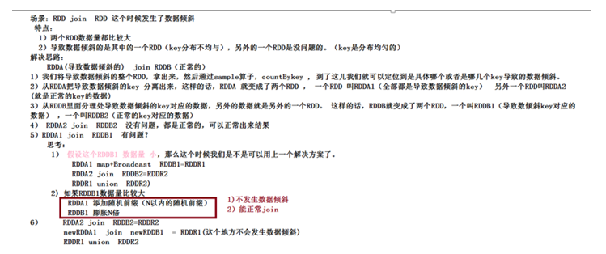

# Spark调优-第二天

## 一 、课前准备

1. 掌握好SparkCore知识

## 二 、课堂主题

本课程主要讲解Spark数据倾斜调优和Spark Shuffle调优，这些在工作里面用的频率较高，面试的频率也很高。

## 三 、课程目标

1. 掌握数据倾斜调优
2. 了解shuffle 调优

## 四 、知识要点

### 4.1 数据倾斜调优(60分钟)

**概述**

有的时候，我们可能会遇到大数据计算中一个最棘手的问题——数据倾斜，此时Spark作业的性能会比期望差很多。数据倾斜调优，就是使用各种技术方案解决不同类型的数据倾斜问题，以保证Spark作业的性能。

**数据倾斜发生时的现象**

绝大多数task执行得都非常快，但个别task执行极慢。比如，总共有1000个task，997个task都在1分钟之内执行完了，但是剩余两三个task却要一两个小时。这种情况很常见。

原本能够正常执行的Spark作业，某天突然报出OOM(内存溢出)异常，观察异常栈，是我们写的业务代码造成的。这种情况比较少见。

**数据倾斜发生的原理**

数据倾斜的原理很简单：在进行shuffle的时候，必须将各个节点上相同的key拉取到某个节点上的一个task来进行处理，比如按照key进行聚合或join等操作。此时如果某个key对应的数据量特别大的话，就会发生数据倾斜。比如大部分key对应10条数据，但是个别key却对应了100万条数据，那么大部分task可能就只会分配到10条数据，然后1秒钟就运行完了;但是个别task可能分配到了100万数据，要运行一两个小时。因此，整个Spark作业的运行进度是由运行时间最长的那个task决定的。
因此出现数据倾斜的时候，Spark作业看起来会运行得非常缓慢，甚至可能因为某个task处理的数据量过大导致内存溢出。
下图就是一个很清晰的例子：hello这个key，在三个节点上对应了总共7条数据，这些数据都会被拉取到同一个task中进行处理;而world和you这两个key分别才对应1条数据，所以另外两个task只要分别处理1条数据即可。此时第一个task的运行时间可能是另外两个task的7倍，而整个stage的运行速度也由运行最慢的那个task所决定。

**如何定位数据倾斜的代码**

数据倾斜只会发生在shuffle过程中。这里给大家罗列一些常用的并且可能会触发shuffle操作的算子：distinct、groupByKey、reduceByKey、aggregateByKey、join、cogroup、repartition等。出现数据倾斜时，可能就是你的代码中使用了这些算子中的某一个所导致的。
某个task执行特别慢的情况
首先要看的，就是数据倾斜发生在第几个stage中。
如果是用yarn-client模式提交，那么本地是直接可以看到log的，可以在log中找到当前运行到了第几个stage;如果是用yarn-cluster模式提交，则可以通过Spark Web UI来查看当前运行到了第几个stage。此外，无论是使用yarn-client模式还是yarn-cluster模式，我们都可以在Spark Web UI上深入看一下当前这个stage各个task分配的数据量，从而进一步确定是不是task分配的数据不均匀导致了数据倾斜。
比如下图中，倒数第三列显示了每个task的运行时间。明显可以看到，有的task运行特别快，只需要几秒钟就可以运行完;而有的task运行特别慢，需要几分钟才能运行完，此时单从运行时间上看就已经能够确定发生数据倾斜了。此外，倒数第一列显示了每个task处理的数据量，明显可以看到，运行时间特别短的task只需要处理几百KB的数据即可，而运行时间特别长的task需要处理几千KB的数据，处理的数据量差了10倍。此时更加能够确定是发生了数据倾斜。

知道数据倾斜发生在哪一个stage之后，接着我们就需要根据stage划分原理，推算出来发生倾斜的那个stage对应代码中的哪一部分，这部分代码中肯定会有一个shuffle类算子。精准推算stage与代码的对应关系，需要对Spark的源码有深入的理解，这里我们可以介绍一个相对简单实用的推算方法：只要看到Spark代码中出现了一个shuffle类算子或者是Spark SQL的SQL语句中出现了会导致shuffle的语句(比如group by语句)，那么就可以判定，以那个地方为界限划分出了前后两个stage。
这里我们就以Spark最基础的入门程序——单词计数来举例，如何用最简单的方法大致推算出一个stage对应的代码。如下示例，在整个代码中，只有一个reduceByKey是会发生shuffle的算子，因此就可以认为，以这个算子为界限，会划分出前后两个stage。
stage0，主要是执行从textFile到map操作，以及执行shuffle write操作。shuffle write操作，我们可以简单理解为对pairs RDD中的数据进行分区操作，每个task处理的数据中，相同的key会写入同一个磁盘文件内。
stage1，主要是执行从reduceByKey到collect操作，stage1的各个task一开始运行，就会首先执行shuffle read操作。执行shuffle read操作的task，会从stage0的各个task所在节点拉取属于自己处理的那些key，然后对同一个key进行全局性的聚合或join等操作，在这里就是对key的value值进行累加。stage1在执行完reduceByKey算子之后，就计算出了最终的wordCounts RDD，然后会执行collect算子，将所有数据拉取到Driver上，供我们遍历和打印输出。

~~~java
val conf = new SparkConf()
val sc = new SparkContext(conf)
val lines = sc.textFile("hdfs://...")
val words = lines.flatMap(_.split(" "))
val pairs = words.map((_, 1))
val wordCounts = pairs.reduceByKey(_ + _)
wordCounts.collect().foreach(println(_))
~~~

通过对单词计数程序的分析，希望能够让大家了解最基本的stage划分的原理，以及stage划分后shuffle操作是如何在两个stage的边界处执行的。然后我们就知道如何快速定位出发生数据倾斜的stage对应代码的哪一个部分了。比如我们在Spark Web UI或者本地log中发现，stage1的某几个task执行得特别慢，判定stage1出现了数据倾斜，那么就可以回到代码中定位出stage1主要包括了reduceByKey这个shuffle类算子，此时基本就可以确定是由educeByKey算子导致的数据倾斜问题。比如某个单词出现了100万次，其他单词才出现10次，那么stage1的某个task就要处理100万数据，整个stage的速度就会被这个task拖慢。
**某个task莫名其妙内存溢出的情况**
这种情况下去定位出问题的代码就比较容易了。我们建议直接看yarn-client模式下本地log的异常栈，或者是通过YARN查看yarn-cluster模式下的log中的异常栈。一般来说，通过异常栈信息就可以定位到你的代码中哪一行发生了内存溢出。然后在那行代码附近找找，一般也会有shuffle类算子，此时很可能就是这个算子导致了数据倾斜。
但是大家要注意的是，不能单纯靠偶然的内存溢出就判定发生了数据倾斜。因为自己编写的代码的bug，以及偶然出现的数据异常，也可能会导致内存溢出。因此还是要按照上面所讲的方法，通过Spark Web UI查看报错的那个stage的各个task的运行时间以及分配的数据量，才能确定是否是由于数据倾斜才导致了这次内存溢出。

**查看导致数据倾斜的key的数据分布情况**

知道了数据倾斜发生在哪里之后，通常需要分析一下那个执行了shuffle操作并且导致了数据倾斜的RDD/Hive表，查看一下其中key的分布情况。这主要是为之后选择哪一种技术方案提供依据。针对不同的key分布与不同的shuffle算子组合起来的各种情况，可能需要选择不同的技术方案来解决。
此时根据你执行操作的情况不同，可以有很多种查看key分布的方式：
如果是Spark SQL中的group by、join语句导致的数据倾斜，那么就查询一下SQL中使用的表的key分布情况。
如果是对Spark RDD执行shuffle算子导致的数据倾斜，那么可以在Spark作业中加入查看key分布的代码，比如RDD.countByKey()。然后对统计出来的各个key出现的次数，collect/take到客户端打印一下，就可以看到key的分布情况。
举例来说，对于上面所说的单词计数程序，如果确定了是stage1的reduceByKey算子导致了数据倾斜，那么就应该看看进行reduceByKey操作的RDD中的key分布情况，在这个例子中指的就是pairs RDD。如下示例，我们可以先对pairs采样10%的样本数据，然后使用countByKey算子统计出每个key出现的次数，最后在客户端遍历和打印样本数据中各个key的出现次数。

~~~java
val sampledPairs = pairs.sample(false, 0.1)
val sampledWordCounts = sampledPairs.countByKey()
sampledWordCounts.foreach(println(_))
~~~

#### 数据倾斜的解决方案

##### 解决方案一：使用Hive ETL预处理数据

方案适用场景：导致数据倾斜的是Hive表。如果该Hive表中的数据本身很不均匀(比如某个key对应了100万数据，其他key才对应了10条数据)，而且业务场景需要频繁使用Spark对Hive表执行某个分析操作，那么比较适合使用这种技术方案。
方案实现思路：此时可以评估一下，是否可以通过Hive来进行数据预处理(即通过Hive ETL预先对数据按照key进行聚合，或者是预先和其他表进行join)，然后在Spark作业中针对的数据源就不是原来的Hive表了，而是预处理后的Hive表。此时由于数据已经预先进行过聚合或join操作了，那么在Spark作业中也就不需要使用原先的shuffle类算子执行这类操作了。
方案实现原理：这种方案从根源上解决了数据倾斜，因为彻底避免了在Spark中执行shuffle类算子，那么肯定就不会有数据倾斜的问题了。但是这里也要提醒一下大家，这种方式属于治标不治本。因为毕竟数据本身就存在分布不均匀的问题，所以Hive ETL中进行group by或者join等shuffle操作时，还是会出现数据倾斜，导致Hive ETL的速度很慢。我们只是把数据倾斜的发生提前到了Hive ETL中，避免Spark程序发生数据倾斜而已。
方案优点：实现起来简单便捷，效果还非常好，完全规避掉了数据倾斜，Spark作业的性能会大幅度提升。
方案缺点：治标不治本，Hive ETL中还是会发生数据倾斜。
方案实践经验：在一些Java系统与Spark结合使用的项目中，会出现Java代码频繁调用Spark作业的场景，而且对Spark作业的执行性能要求很高，就比较适合使用这种方案。将数据倾斜提前到上游的Hive ETL，每天仅执行一次，只有那一次是比较慢的，而之后每次Java调用Spark作业时，执行速度都会很快，能够提供更好的用户体验。
项目实践经验：有一个交互式用户行为分析系统中使用了这种方案，该系统主要是允许用户通过Java Web系统提交数据分析统计任务，后端通过Java提交Spark作业进行数据分析统计。要求Spark作业速度必须要快，尽量在10分钟以内，否则速度太慢，用户体验会很差。所以我们将有些Spark作业的shuffle操作提前到了Hive ETL中，从而让Spark直接使用预处理的Hive中间表，尽可能地减少Spark的shuffle操作，大幅度提升了性能，将部分作业的性能提升了6倍以上。

##### 解决方案二：过滤少数导致倾斜的key

　　方案适用场景：如果发现导致倾斜的key就少数几个，而且对计算本身的影响并不大的话，那么很适合使用这种方案。比如99%的key就对应10条数据，但是只有一个key对应了100万数据，从而导致了数据倾斜。
　　方案实现思路：如果我们判断那少数几个数据量特别多的key，对作业的执行和计算结果不是特别重要的话，那么干脆就直接过滤掉那少数几个key。比如，在Spark SQL中可以使用where子句过滤掉这些key或者在Spark Core中对RDD执行filter算子过滤掉这些key。如果需要每次作业执行时，动态判定哪些key的数据量最多然后再进行过滤，那么可以使用sample算子对RDD进行采样，然后计算出每个key的数量，取数据量最多的key过滤掉即可。
　　方案实现原理：将导致数据倾斜的key给过滤掉之后，这些key就不会参与计算了，自然不可能产生数据倾斜。
　　方案优点：实现简单，而且效果也很好，可以完全规避掉数据倾斜。
　　方案缺点：适用场景不多，大多数情况下，导致倾斜的key还是很多的，并不是只有少数几个。
　　方案实践经验：在项目中我们也采用过这种方案解决数据倾斜。有一次发现某一天Spark作业在运行的时候突然OOM了，追查之后发现，是Hive表中的某一个key在那天数据异常，导致数据量暴增。因此就采取每次执行前先进行采样，计算出样本中数据量最大的几个key之后，直接在程序中将那些key给过滤掉。

##### 解决方案三：提高shuffle操作的并行度(效果差)

　　　方案适用场景：如果我们必须要对数据倾斜迎难而上，那么建议优先使用这种方案，因为这是处理数据倾斜最简单的一种方案。
　　　方案实现思路：在对RDD执行shuffle算子时，给shuffle算子传入一个参数，比如reduceByKey(1000)，该参数就设置了这个shuffle算子执行时shuffle read task的数量。对于Spark SQL中的shuffle类语句，比如group by、join等，需要设置一个参数，即spark.sql.shuffle.partitions，该参数代表了shuffle read task的并行度，该值默认是200，对于很多场景来说都有点过小。
　　　方案实现原理：增加shuffle read task的数量，可以让原本分配给一个task的多个key分配给多个task，从而让每个task处理比原来更少的数据。举例来说，如果原本有5个key，每个key对应10条数据，这5个key都是分配给一个task的，那么这个task就要处理50条数据。而增加了shuffle read task以后，每个task就分配到一个key，即每个task就处理10条数据，那么自然每个task的执行时间都会变短了。具体原理如下图所示。
　　　方案优点：实现起来比较简单，可以有效缓解和减轻数据倾斜的影响。
　　　方案缺点：只是缓解了数据倾斜而已，没有彻底根除问题，根据实践经验来看，其效果有限。
　　　方案实践经验：该方案通常无法彻底解决数据倾斜，因为如果出现一些极端情况，比如某个key对应的数据量有100万，那么无论你的task数量增加到多少，这个对应着100万数据的key肯定还是会分配到一个task中去处理，因此注定还是会发生数据倾斜的。所以这种方案只能说是在发现数据倾斜时尝试使用的第一种手段，尝试去用嘴简单的方法缓解数据倾斜而已，或者是和其他方案结合起来使用。

##### 解决方案四：两阶段聚合（局部聚合+全局聚合）

　　方案适用场景：对RDD执行reduceByKey等聚合类shuffle算子或者在Spark SQL中使用group by语句进行分组聚合时，比较适用这种方案。
　　方案实现思路：这个方案的核心实现思路就是进行两阶段聚合。第一次是局部聚合，先给每个key都打上一个随机数，比如10以内的随机数，此时原先一样的key就变成不一样的了，比如(hello, 1) (hello, 1) (hello, 1) (hello, 1)，就会变成(1_hello, 1) (1_hello, 1) (2_hello, 1) (2_hello, 1)。接着对打上随机数后的数据，执行reduceByKey等聚合操作，进行局部聚合，那么局部聚合结果，就会变成了(1_hello, 2) (2_hello, 2)。然后将各个key的前缀给去掉，就会变成(hello,2)(hello,2)，再次进行全局聚合操作，就可以得到最终结果了，比如(hello, 4)。
　　方案实现原理：将原本相同的key通过附加随机前缀的方式，变成多个不同的key，就可以让原本被一个task处理的数据分散到多个task上去做局部聚合，进而解决单个task处理数据量过多的问题。接着去除掉随机前缀，再次进行全局聚合，就可以得到最终的结果。具体原理见下图。
　　方案优点：对于聚合类的shuffle操作导致的数据倾斜，效果是非常不错的。通常都可以解决掉数据倾斜，或者至少是大幅度缓解数据倾斜，将Spark作业的性能提升数倍以上。
　　方案缺点：仅仅适用于聚合类的shuffle操作，适用范围相对较窄。如果是join类的shuffle操作，还得用其他的解决方案。

~~~scala
object WordCountAggTest {
  def main(args: Array[String]): Unit = {
    val conf = new SparkConf().setMaster("local").setAppName("WordCount")
    val sc = new SparkContext(conf)
    val array = Array("you you","you you","you you",
      "you you",
      "you you",
      "you you",
      "you you",
      "jump jump")
    val rdd = sc.parallelize(array,8)
    rdd.flatMap( line => line.split(" "))
      .map(word =>{
        val prefix = (new util.Random).nextInt(3)
        (prefix+"_"+word,1)
      }).reduceByKey(_+_)
       .map( wc =>{
         val newWord=wc._1.split("_")(1)
         val count=wc._2
         (newWord,count)
       }).reduceByKey(_+_)
      .foreach( wc =>{
        println("单词："+wc._1 + " 次数："+wc._2)
      })

  }
}
注：我们这儿使用的是reduceByKey天然的有调优的效果，如果这儿是groupBykey那么发生数据倾斜的概率就会更大，更严重。
~~~

##### 解决方案五：将reduce join转为map join

　　方案适用场景：在对RDD使用join类操作，或者是在Spark SQL中使用join语句时，而且join操作中的一个RDD或表的数据量比较小（比如几百M或者一两G），比较适用此方案。
　　方案实现思路：不使用join算子进行连接操作，而使用Broadcast变量与map类算子实现join操作，进而完全规避掉shuffle类的操作，彻底避免数据倾斜的发生和出现。将较小RDD中的数据直接通过collect算子拉取到Driver端的内存中来，然后对其创建一个Broadcast变量；接着对另外一个RDD执行map类算子，在算子函数内，从Broadcast变量中获取较小RDD的全量数据，与当前RDD的每一条数据按照连接key进行比对，如果连接key相同的话，那么就将两个RDD的数据用你需要的方式连接起来。
　　方案实现原理：普通的join是会走shuffle过程的，而一旦shuffle，就相当于会将相同key的数据拉取到一个shuffle read task中再进行join，此时就是reduce join。但是如果一个RDD是比较小的，则可以采用广播小RDD全量数据+map算子来实现与join同样的效果，也就是map join，此时就不会发生shuffle操作，也就不会发生数据倾斜。具体原理如下图所示。
　　方案优点：对join操作导致的数据倾斜，效果非常好，因为根本就不会发生shuffle，也就根本不会发生数据倾斜。
　　方案缺点：适用场景较少，因为这个方案只适用于一个大表和一个小表的情况。毕竟我们需要将小表进行广播，此时会比较消耗内存资源，driver和每个Executor内存中都会驻留一份小RDD的全量数据。如果我们广播出去的RDD数据比较大，比如10G以上，那么就可能发生内存溢出了。因此并不适合两个都是大表的情况。

~~~scala
object MapJoinTest {
 
  def main(args: Array[String]): Unit = {
    val conf = new SparkConf().setMaster("local").setAppName("WordCount")
    val sc = new SparkContext(conf)
    val lista=Array(
      Tuple2("001","令狐冲"),
      Tuple2("002","任盈盈")
    )
     //数据量小一点
    val listb=Array(
      Tuple2("001","一班"),
      Tuple2("002","二班")
    )
    val listaRDD = sc.parallelize(lista)
    val listbRDD = sc.parallelize(listb)
    //val result: RDD[(String, (String, String))] = listaRDD.join(listbRDD)
     //设置广播变量
    val listbBoradcast = sc.broadcast(listbRDD.collect())
    listaRDD.map(  tuple =>{
      val key = tuple._1
      val name = tuple._2
      val map = listbBoradcast.value.toMap
      val className = map.get(key)
      (key,(name,className))
    }).foreach( tuple =>{
      println("班级号"+tuple._1 + " 姓名："+tuple._2._1 + " 班级名："+tuple._2._2.get)
    })
  }
}
~~~

##### 解决方案六：采样倾斜key并分拆join操作

　　方案适用场景：两个RDD/Hive表进行join的时候，如果数据量都比较大，无法采用“解决方案五”，那么此时可以看一下两个RDD/Hive表中的key分布情况。如果出现数据倾斜，是因为其中某一个RDD/Hive表中的少数几个key的数据量过大，而另一个RDD/Hive表中的所有key都分布比较均匀，那么采用这个解决方案是比较合适的。
　　方案实现思路：
　　1、对包含少数几个数据量过大的key的那个RDD，通过sample算子采样出一份样本来，然后统计一下每个key的数量，计算出来数据量最大的是哪几个key。
　　2、然后将这几个key对应的数据从原来的RDD中拆分出来，形成一个单独的RDD，并给每个key都打上n以内的随机数作为前缀，而不会导致倾斜的大部分key形成另外一个RDD。
　　3、接着将需要join的另一个RDD，也过滤出来那几个倾斜key对应的数据并形成一个单独的RDD，将每条数据膨胀成n条数据，这n条数据都按顺序附加一个0~n的前缀，不会导致倾斜的大部分key也形成另外一个RDD。
　　4、再将附加了随机前缀的独立RDD与另一个膨胀n倍的独立RDD进行join，此时就可以将原先相同的key打散成n份，分散到多个task中去进行join了。
　　5、而另外两个普通的RDD就照常join即可。
　　6、最后将两次join的结果使用union算子合并起来即可，就是最终的join结果。
　　方案实现原理：对于join导致的数据倾斜，如果只是某几个key导致了倾斜，可以将少数几个key分拆成独立RDD，并附加随机前缀打散成n份去进行join，此时这几个key对应的数据就不会集中在少数几个task上，而是分散到多个task进行join了。具体原理见下图。
　　方案优点：对于join导致的数据倾斜，如果只是某几个key导致了倾斜，采用该方式可以用最有效的方式打散key进行join。而且只需要针对少数倾斜key对应的数据进行扩容n倍，不需要对全量数据进行扩容。避免了占用过多内存。
　　方案缺点：如果导致倾斜的key特别多的话，比如成千上万个key都导致数据倾斜，那么这种方式也不适合。

##### 解决方案七：使用随机前缀和扩容RDD进行join
　　方案适用场景：如果在进行join操作时，RDD中有大量的key导致数据倾斜，那么进行分拆key也没什么意义，此时就只能使用这一种方案来解决问题了。
　　方案实现思路：
　　1、该方案的实现思路基本和“解决方案六”类似，首先查看RDD/Hive表中的数据分布情况，找到那个造成数据倾斜的RDD/Hive表，比如有多个key都对应了超过1万条数据。
　　2、然后将该RDD的每条数据都打上一个n以内的随机前缀。
　　3、同时对另外一个正常的RDD进行扩容，将每条数据都扩容成n条数据，扩容出来的每条数据都依次打上一个0~n的前缀。
　　4、最后将两个处理后的RDD进行join即可。
　　方案实现原理：将原先一样的key通过附加随机前缀变成不一样的key，然后就可以将这些处理后的“不同key”分散到多个task中去处理，而不是让一个task处理大量的相同key。该方案与“解决方案六”的不同之处就在于，上一种方案是尽量只对少数倾斜key对应的数据进行特殊处理，由于处理过程需要扩容RDD，因此上一种方案扩容RDD后对内存的占用并不大；而这一种方案是针对有大量倾斜key的情况，没法将部分key拆分出来进行单独处理，因此只能对整个RDD进行数据扩容，对内存资源要求很高。
　　方案优点：对join类型的数据倾斜基本都可以处理，而且效果也相对比较显著，性能提升效果非常不错。
　　方案缺点：该方案更多的是缓解数据倾斜，而不是彻底避免数据倾斜。而且需要对整个RDD进行扩容，对内存资源要求很高。
　　方案实践经验：曾经开发一个数据需求的时候，发现一个join导致了数据倾斜。优化之前，作业的执行时间大约是60分钟左右；使用该方案优化之后，执行时间缩短到10分钟左右，性能提升了6倍。

##### 解决方案八：把上面的几种数据倾斜的解决方案综合的灵活运行

### 4.2 Shuffle调优（50分钟）

##### 4.2.1 什么时候发生shuffle

##### 4.2.2 Shuffle的核心组件

碰到ShuffleDenpendency就进行stage的划分，ShuffleMapStage: 为shuffle提供数据的中间stage，ResultStage: 为一个action操作计算结果的stage。

##### 4.2.3 Shuffle组件调度

##### 4.2.4 Shuffle原理剖析

###### 4.2.4.1 MapOutputTracker

解决的一个问题是resut task如何知道从哪个Executor去拉取Shuffle data

###### 4.2.4.2 ShuffleWriter

**（1）HashShuffleWriter**

特点：根据Hash分区，分区数是m * n 个。

~~~scala
val counts: RDD[(String, Int)] 
	= wordCount.reduceByKey(new HashPartitioner(2), (x, y) => x + y)

~~~

**（2）SortShuffleWriter**

特点：

a、文件数量为m

b、如果需要排序或者需要combine，那么每一个partition数据排序要自己实现。（SortShuffleWriter里的sort指的是对partition的分区号进行排序）

c、数据先放在内存,内存不够则写到磁盘中,最后再全部写到磁盘。

**（3）UnsafeShuffleWriter**

使用UnsafeShuffleWriter的条件：

a、不支持combine或者排序的操作（因为UnsafeShuffleWriter里面一开始就对数据进行了序列化，也就是说里面的数据是字节，字节不能进行排序，肯定也不能进行combine了，不过UnsafeShuffleWriter之所以性能好的原因也在于这儿，因为在内存里面的时候就是字节，所以写磁盘的时候不需要序列化就直接把字节写到磁盘上就可以，最后再把数据合并成最终文件的时候，需要磁盘里的老数据和内存里的数据进行合并，因为内存里的数据本来就是字节，所以就可以直接合并完了以后写到磁盘就可以，性能很好。但是SortShuffleWriter里内存里存的都是对象，需要多次进行序列化和反序列化性能差）

b、序列化需要支持re-ordered

c、输出的最多分区文件数小于16777216，这个是因为内部实现的时候将partitionId，encode到记录中，然后用24位来记录，这个partitionId，所以最大为(1 << 24)

**（4）BypassMergeSortShuffleWriter**

这种模式同时具有HashShuffleWriter和SortShuffleter的特点。因为其实HashShufflerWriter的性能不错，但是如果task数太多的话，性能话下降，所以Spark在task数较少的时候自动使用了这种模式，一开始还是像HashShufflerWriter那种生成多个文件，但是最后会把多个文件合并成一个文件。然后下游来读取文件。默认map的分区需要小于spark.shuffle.sort.bypassMergeThreshold(默认是200),因为如何分区数太多，产生的小文件就会很多性能就会下降。

###### 4.2.4.3 ShuffleReader

###### 4.2.4.4 Spark Shuffle参数调优

spark.shuffle.file.buffer

- 默认值：32k
- 参数说明：该参数用于设置shuffle write task的BufferedOutputStream的buffer缓冲大小。将数据写到磁盘文件之前，会先写入buffer缓冲中，待缓冲写满之后，才会溢写到磁盘。
- 调优建议：如果作业可用的内存资源较为充足的话，可以适当增加这个参数的大小（比如64k），从而减少shuffle write过程中溢写磁盘文件的次数，也就可以减少磁盘IO次数，进而提升性能。在实践中发现，合理调节该参数，性能会有1%~5%的提升。

spark.reducer.maxSizeInFlight

- 默认值：48m
- 参数说明：该参数用于设置shuffle read task的buffer缓冲大小，而这个buffer缓冲决定了每次能够拉取多少数据。
- 调优建议：如果作业可用的内存资源较为充足的话，可以适当增加这个参数的大小（比如96m），从而减少拉取数据的次数，也就可以减少网络传输的次数，进而提升性能。在实践中发现，合理调节该参数，性能会有1%~5%的提升。

spark.shuffle.io.maxRetries

- 默认值：3
- 参数说明：shuffle read task从shuffle write task所在节点拉取属于自己的数据时，如果因为网络异常导致拉取失败，是会自动进行重试的。该参数就代表了可以重试的最大次数。如果在指定次数之内拉取还是没有成功，就可能会导致作业执行失败。
- 调优建议：对于那些包含了特别耗时的shuffle操作的作业，建议增加重试最大次数（比如60次），以避免由于JVM的full gc或者网络不稳定等因素导致的数据拉取失败。在实践中发现，对于针对超大数据量（数十亿~上百亿）的shuffle过程，调节该参数可以大幅度提升稳定性。

spark.shuffle.io.retryWait

- 默认值：5s
- 参数说明：具体解释同上，该参数代表了每次重试拉取数据的等待间隔，默认是5s。
- 调优建议：建议加大间隔时长（比如60s），以增加shuffle操作的稳定性。

spark.shuffle.memoryFraction（Spark1.6是这个参数，1.6以后参数变了，具体参考上一讲Spark内存模型知识）

- 默认值：0.2
- 参数说明：该参数代表了Executor内存中，分配给shuffle read task进行聚合操作的内存比例，默认是20%。
- 调优建议：在资源参数调优中讲解过这个参数。如果内存充足，而且很少使用持久化操作，建议调高这个比例，给shuffle read的聚合操作更多内存，以避免由于内存不足导致聚合过程中频繁读写磁盘。在实践中发现，合理调节该参数可以将性能提升10%左右。

spark.shuffle.manager

- 默认值：sort
- 参数说明：该参数用于设置ShuffleManager的类型。Spark 1.5以后，有三个可选项：hash、sort和tungsten-sort。HashShuffleManager是Spark 1.2以前的默认选项，但是Spark 1.2以及之后的版本默认都是SortShuffleManager了。Spark1.6以后把hash方式给移除了，tungsten-sort与sort类似，但是使用了tungsten计划中的堆外内存管理机制，内存使用效率更高。
- 调优建议：由于SortShuffleManager默认会对数据进行排序，因此如果你的业务逻辑中需要该排序机制的话，则使用默认的SortShuffleManager就可以；而如果你的业务逻辑不需要对数据进行排序，那么建议参考后面的几个参数调优，通过bypass机制或优化的HashShuffleManager来避免排序操作，同时提供较好的磁盘读写性能。这里要注意的是，tungsten-sort要慎用，因为之前发现了一些相应的bug。

spark.shuffle.sort.bypassMergeThreshold

- 默认值：200
- 参数说明：当ShuffleManager为SortShuffleManager时，如果shuffle read task的数量小于这个阈值（默认是200），则shuffle write过程中不会进行排序操作，而是直接按照未经优化的HashShuffleManager的方式去写数据，但是最后会将每个task产生的所有临时磁盘文件都合并成一个文件，并会创建单独的索引文件。
- 调优建议：当你使用SortShuffleManager时，如果的确不需要排序操作，那么建议将这个参数调大一些，大于shuffle read task的数量。那么此时就会自动启用bypass机制，map-side就不会进行排序了，减少了排序的性能开销。但是这种方式下，依然会产生大量的磁盘文件，因此shuffle write性能有待提高。

## 五 、面试问题

1. 你在工作当中遇到哪些数据倾斜的场景，你是如何处理的？
2. 你在工作当中调过优吗？怎么处理的？效果怎么样？
3.  Spark Shuffle的发展过程

## 六 、总结（5分钟）

1. 数据倾斜调优的场景和解决方式，这些知识同样可以使用到后面学的SparkStremaing中去
2. Shuffle调优

## 七 、作业

各位同学用Xmind自己整理笔记，梳理。可以选择自己讲给自己听，面试的时候一定要回答出来。

## 八 、互动

